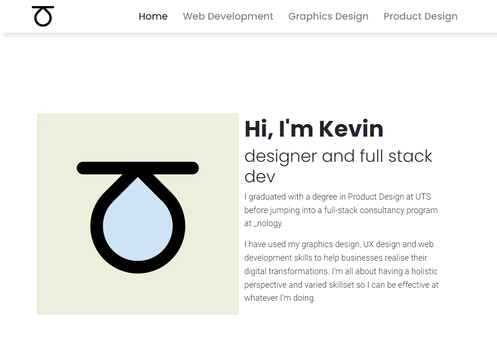
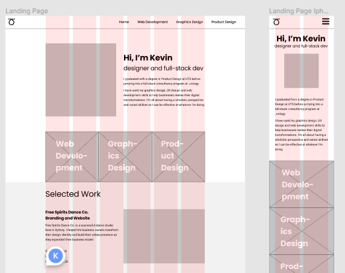
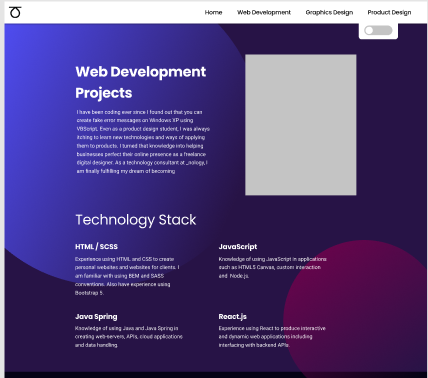
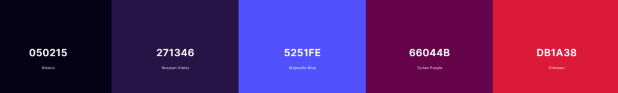

# Personal Portfolio Website

This is my personal website to be used as a digital portfolio for my design and
web development experience. It was designed in Figma and uses Bootstrap 5.0 for
layout and SCSS.

## [**Find this website hosted here**](https://kchn.com.au)

## Contents

-   ## [Project Brief](#project-brief-1)
-   ## [Design](#design-1)
-   ## [Technical Implementation](#technical-implementation-1)
-   ## [Project Reflection](#project-reflection-1)

---

## Project Brief

### Aims

The aim of this website was to adequately demonstrate my skills as a designer
and web developer. It also served as an opportunity to reinforce learning on
UX/UI fundamentals and basic front-end development. It also serves as a way to
practice Git flow and

### Minimum Viable Product

-   Landing page with name and title.
-   About section with my bio.
-   Tech stacks/skills section with all of the technologies I have learned
    during the course.
-   Projects sections with all of my projects. Each project should have:
    -   A short description.
    -   A link to a live version
    -   A link to the GitHub repo (where it applies)
-   Needs links to my professional social media:
    -   LinkedIn
    -   GitHub
    -   Instagram
    -   Email

### Project Aspirations

For this website, I wanted to stand out from other candidates with a
well-developed UX/UI design as well as to demonstrate some JavaScript DOM
skills.

---

## Design

This project was designed in Figma.

### Wireframes

Wireframes were designed with complete copy text to get a sense of the website
layout. I used this process to quickly determine the best content flow that
would work for the given sections.

This was where I decided on producing a website with the modern style of having
lots of padding between sections of content to improve visual clarity.

### User Interface Design

_The web development landing page in Figma_

The design for each landing page design was inspired by colour palettes
generated using [coolors.co](https://coolors.co/). The graphic layout was then
designed in Figma with the capabilities of HTML and CSS, and responsive design
in mind.

_The corresponding colour palette for the web development landing page._

---

## Technical Implementation

### Bootstrap

I chose to use Bootstrap to make a responsive layout in the interest of time
efficiency. Partway into the project, after finding that I was still using
extensive custom css, I realised that I needed to be more consistent between
using Bootstrap classes and my own styling. I resolved to try to use Bootstrap
for layout and everything else would be my own.

This was effective at eliminating some of the styling clashes that I produced
because of messy code. In the future I should create a more specific set of
rules of when to use framework or custom styling so the whole project can be
more consistent.

### SASS/SCSS

The choice to use SCSS mainly served as a way for me to reinforce the SCSS
concepts that I learned before. I structured my SCSS like so:

-   CSS
    -   partials
        -   index
        -   config
        -   mixins
    -   modules
        -   index
        -   navbar
        -   footer

Where the partials folder contained all of the variables and mixins that other
modules will use, and in the modules will be separate styling for different
website sections.

Each folder had an index.scss file that forwarded every other file in its
folder. I found that this was convenient as adding files meant that I didn't
need to specifically import it into every file that needed it.

### Using ::before and ::after pseudo-elements

One of the ways that I used pseudo-elements in this project is extending the
background colour of some elements to the left and right of it, making it seem
like the element is the full width of the browser.

I did this because I could use a @mixin to achieve this effect and avoid overly
nesting divs to have full width elements with max-width content.

Another way I used pseudo-elements is in a hero section where the background
needed to have some simple shapes. This was useful because I could avoid using
large images and the graphic elements could be made to be responsive.

### 3D CSS Scrolling Text effect

See this tutorial from Kevin Powell and Amit Sheen:
[3D text animations with CSS](https://www.youtube.com/watch?v=NSWr6dkc_Xw&t=99s).

---

## Project Reflection

Overall the project achieved its goals and satisfies the MVP.

There are some small design choices I think might be changed. For example, the
three links under my bio on the home page looks awkward and floating.

In the future I plan to add a UX design section to the Product Design page with
its own animated hero section.
